# Noncopyable

# Copyable

- Swift에서는 모든 타입에서 Copy가 가능함
    - Value type
        
        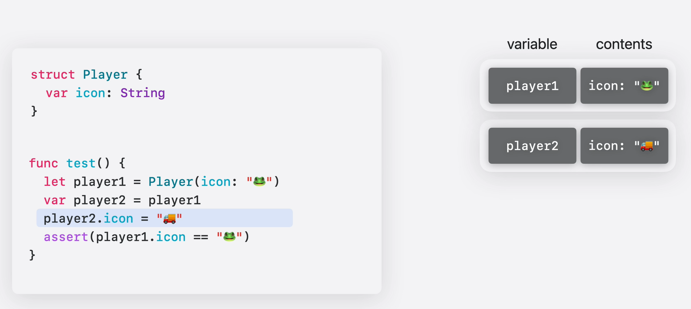
        
        - `Player`는 Value type인 struct임. 즉, 복사시에 값 자체를 복사함.
        - `player1`을 `player2`에 복사. 값만 복사됨.
        - `Player`가 Value type이므로 `player2`를 수정해도 `player1`에 영향이 없음.
    - Reference type
        
        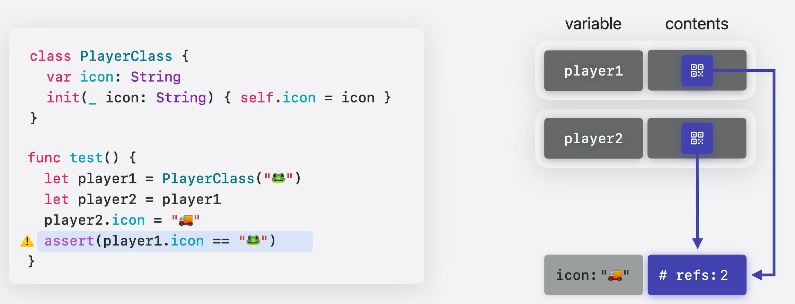
        
        - `Player`는 Reference type인 class임. 즉, 복사시에 참조를 복사함.
        - `player1`을 `player2`에 복사. 참조만 복사되므로 결국 동일한 객체를 의미함.
        - `player2`를 수정하면 같은 객체를 참조하는 `player1`에도 적용됨.
- Swift에서는 모든 것이 Copyable임
    
    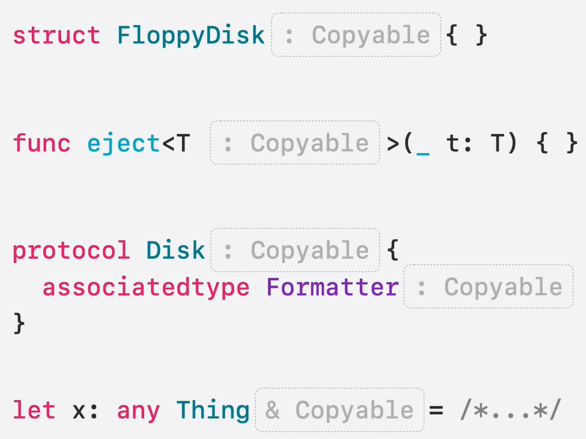
    

## ⚠️ Problem

### BankTransfer example

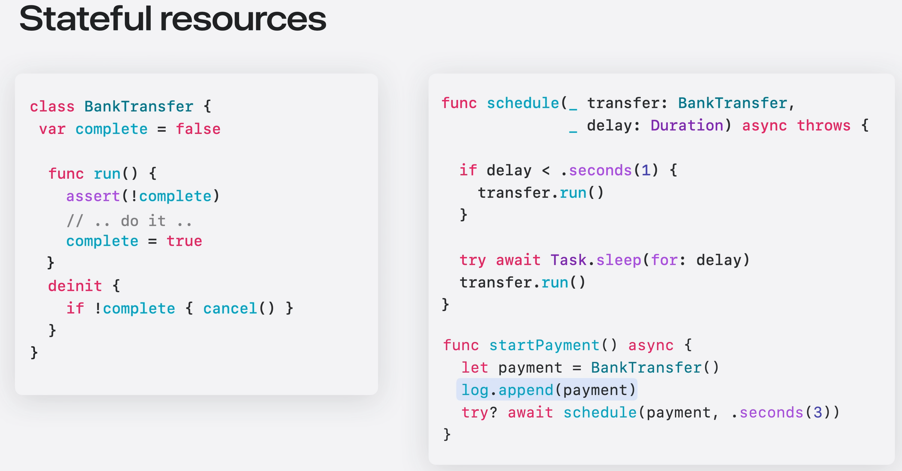

- 위 코드는 여러 가지 문제가 있음
    1. 이체가 두 번 발생할 가능성이 있음
        - `schedule` 함수의 if문 안에 `return` 구문이 없기 때문.
        - `BankTransfer.run` 함수에서 `assert`로 검증하지만 이로 인해 서비스가 중단될 수 있음.
    2. 이체 취소 시 취소가 제대로 안 될 가능성이 있음
        - `startPayment` 함수에서 `log`에 `payment` 객체를 (얕은) 복사해 넣기 때문에 `deinit`이 호출되지 않음.

💡 **이런 상황에서는 `BankTransfer`가 noncopyable인 것이 낫다!**

---

# Noncopyable

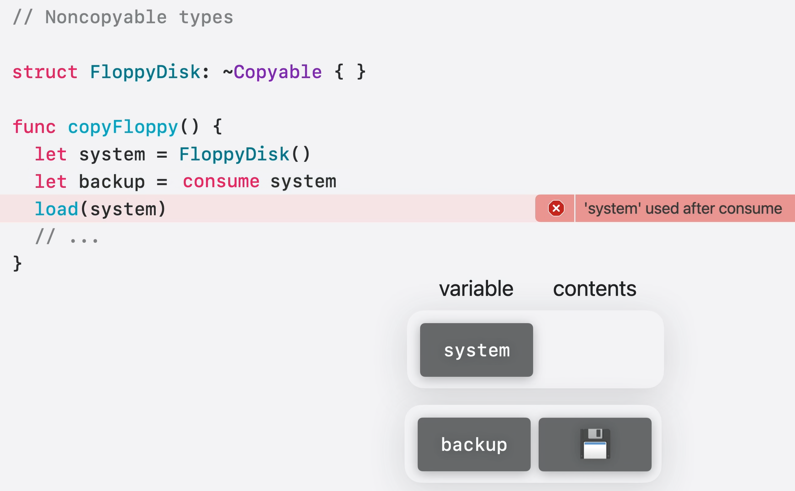

- `~Copyable`을 준수하도록 명시하면 `Copyable`을 준수하지 않는 타입이 됨.
    - `Copyable`을 준수하지 않는 것이지, `Noncopyable`을 준수하는 것은 아님.
- `system`은 `noncopyable` 타입이므로 `backup`으로 복사되지 않고 `consume`됨.
    - `consume` 키워드는 생략해도 무방.
- 이후에 `system`을 읽으면 아무것도 없기 때문에 에러가 발생함.

## Consume by function

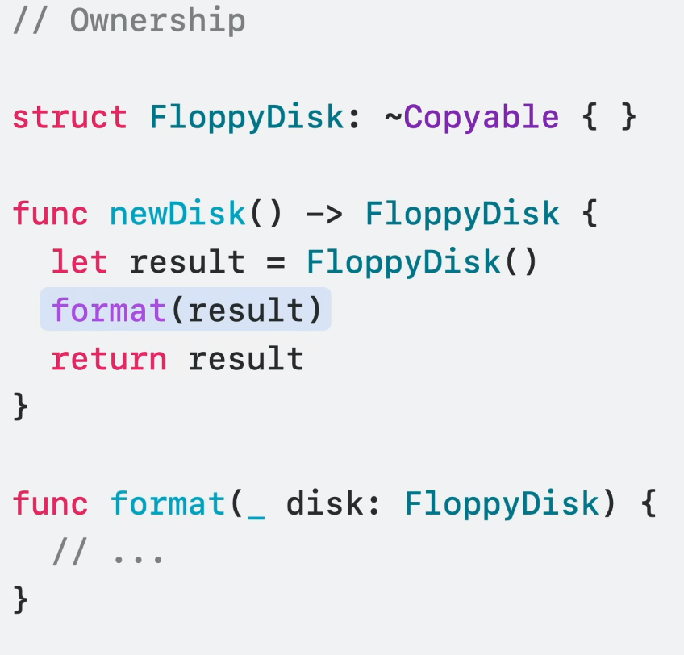

- 함수를 통해 `result`를 사용한다면 어떻게 될까?
    - 함수에서 파라미터에 대해 어떤 소유권이 필요한지 선언하지 않았으므로 알 수 없음.
    - `result`를 복사할 수 없기 때문에 소유권을 명시해줘야 함.
    - **3가지의 소유권 종류가 있음.**

### Consuming

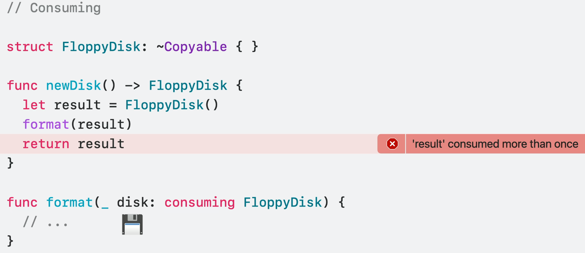

- `consuming`으로 선언하면 함수가 `result`를 `consume`해버림.
- 이 경우 `result`를 이미 `consume`했기 때문에 아무것도 반환할 수 없음.

### Borrowing

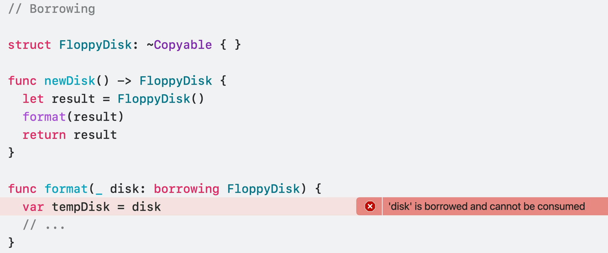

- `borrowing`으로 선언하면 함수가 `result`를 **읽기 전용(read-only)**으로 사용함.
    - `let` 바인딩과 유사.
- `result`에 대해 `consume`이나 수정이 불가능 함.
- `Copyable` 유형을 파라미터로 사용하는 것과 동일한 방식.

### Inout

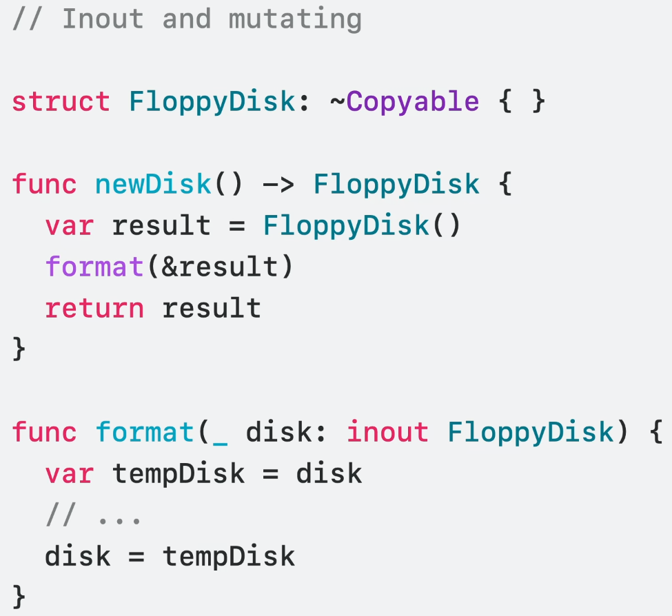

- `inout`으로 선언하면 `result`에 대한 임시 쓰기 접근 권한을 가짐.
- `consume`도 가능하지만, `consume`을 하게 되면 파라미터를 다시 초기화해야 함.

---

## **BankTransfer example with noncopyable**

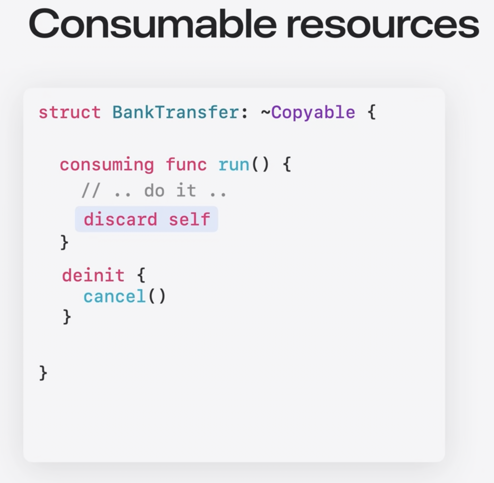

- `run` 함수를 `consuming`으로 선언
    - `run` 함수는 단 한 번만 호출됨을 보장함.
    - 함수 마지막에서 `discard self` 호출로 `deinit` 없이 스스로를 파기함(이체 완료 시 `cancel` 동작이 필요 없으므로).
- `complete` 플래그 없이 `deinit` 함수 구현도 가능해짐(`consume` 되지 않고 객체가 파기되는 경우).

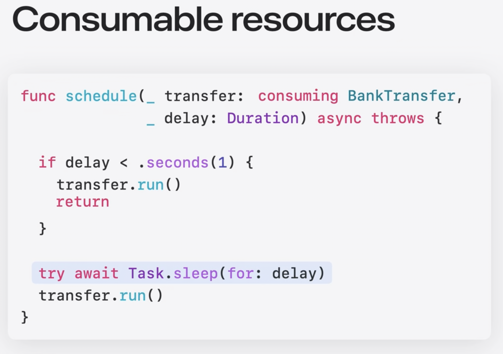

- `schedule` 함수의 `transfer` 파라미터를 `consuming`으로 선언.
    - `transfer`가 해당 함수에서 소비될 것이기 때문.
- if 구문 내에 `return` 추가하여 `run`이 2번 호출되는 에러(`transfer`가 2번 소비되는 에러)를 방지.
- `sleep` 작업 취소 시 `transfer`는 `deinit` 되며 이체를 취소.

---

# Noncopyable Generic

## Generic function

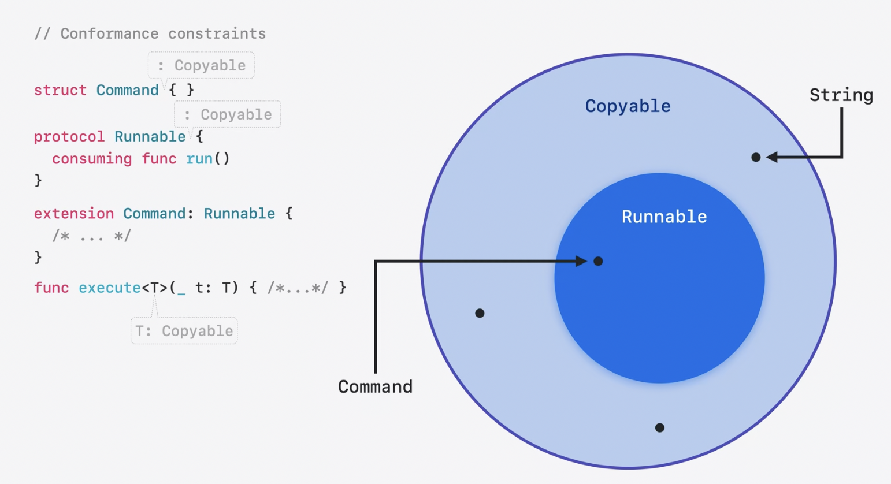

- 지금까지 모든 타입들은 모두 `Copyable`을 준수했음.
- `excute` 함수의 `T` 또한 기본적으로 `Copyable`임.

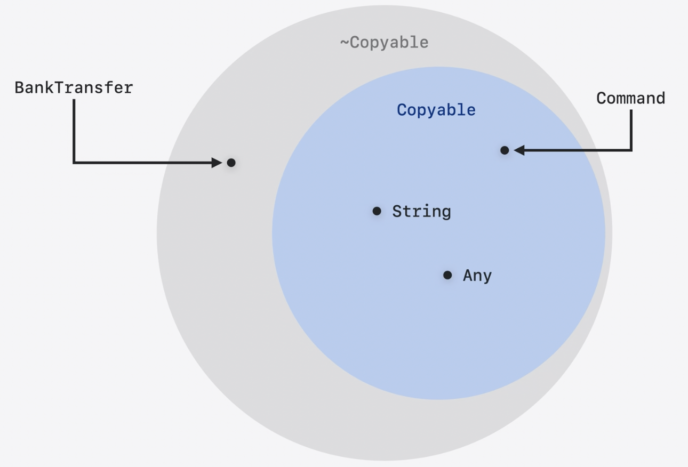

- Swift 5.9부터는 `~Copyable`이 등장하며 확장됨.
    - `~Copyable`이라는 것은 `Copyable`인지 아닌지 모른다는 의미.

---

# **Extensions**

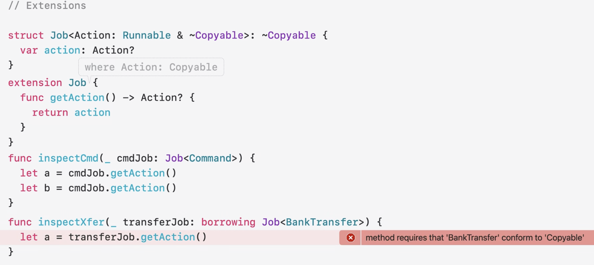

- extension은 기본적으로 모든 Generic 파라미터(`Action`)들을 `Copyable`로 제한함.
- 그래서 `getAction` 함수 내에서 복사가 일어났으나 에러는 안 생김.
- 반면, `inspectXfer` 함수에서 `getAction` 함수를 사용할 때는 에러가 발생.
    - `BankTransfer`는 `~Copyable`이기 때문!

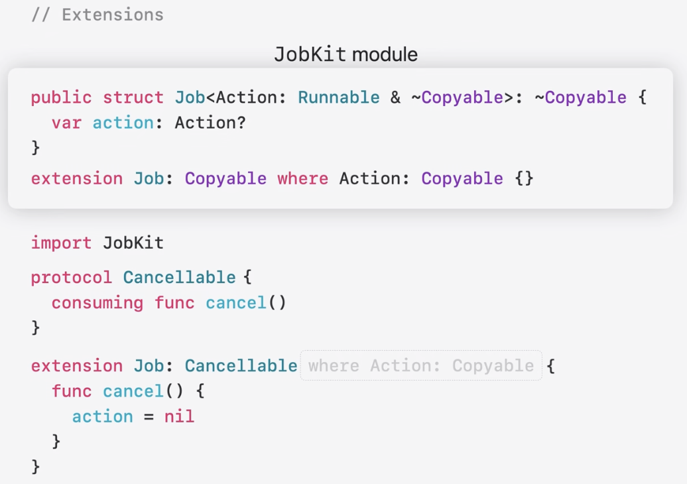

- `Job`을 외부 모듈(`JobKit`)로 생성하고 `Job`의 extension을 만들어 봄.
    - `Cancellable`을 준수하고 있음.
    - 기본적으로 Generic 파라미터에 `Copyable`이 적용됨.
    - 즉, `Job`은 `Action`이 `Copyable` 일 때만 `Cancellable`을 선택적으로 준수하는 것임.

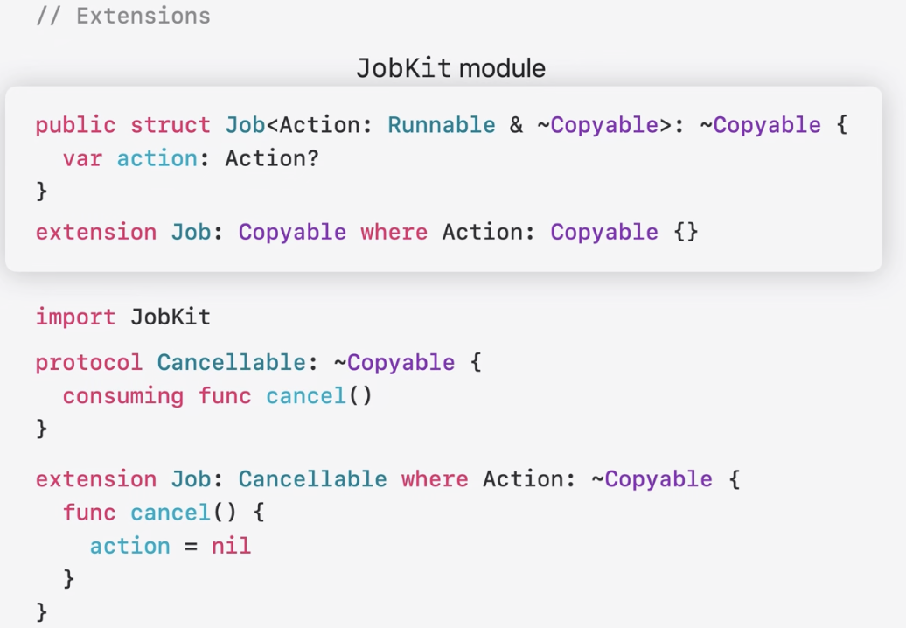

- Generic 파라미터가 `Copyable`임을 가정하지 않게 하려면 `~Copyable`을 명시해야 함.
- `Cancellable`도 기본적으로 `Copyable`이므로 `~Copyable`을 명시해줘야 함.
