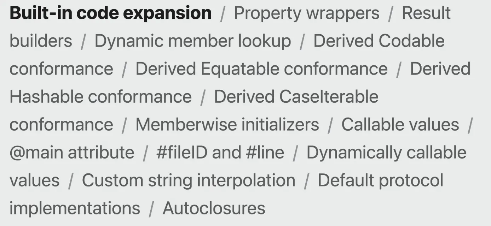

    # Swift Macros

[https://youtu.be/2OCPdw2KTic?feature=shared](https://youtu.be/2OCPdw2KTic?feature=shared)

[https://developer.apple.com/videos/wwdc2023](https://developer.apple.com/videos/wwdc2023)

[https://sujinnaljin.medium.com/swift-매크로-5e232b78dc5b](https://sujinnaljin.medium.com/swift-%EB%A7%A4%ED%81%AC%EB%A1%9C-5e232b78dc5b)

## Why Macros

- Swift에는 이미 보일러 플레이트 코드들을 제거하기 위한 기능들이 존재함.(컴파일러에서 자동으로 필요한 코드 블록을 추가(Expand)함)
    
    
    
    - Synthesized Conformance(프로토콜 자동 준수 매커니즘)
        - ex) 어떤 구현에 Equatable을 만족하도록 하면 자동으로 == 함수를 구현해주는 경우
    - Result builder
- 이미 지원하는 기능으로 구현이 불가능한 경우를 위해 만들어진 개념
- Swift의 매크로로 지원하는 기능을 추가하기 위해서 컴파일러를 수정하는 것이 아니라, Swift 패키지로 배포한다.
    
    
    

## Swift Macro의 필요성


- 위 코드는 실수하기도 쉽고, 중복도 심함.


- `stringify`라는 매크로를 사용해서 문제 해결.

## Design philosophy

### 1. 매크로임을 명확히 해야한다.

- 매크로에는 아래 두 종류가 있음.
    1. freestanding 매크로 - 항상 pound(`#`) 기호로 시작
    2. attached 매크로 - 항상 at(`@`) 기호로 시작
- `#` or `@` 기호가 붙어 있는지 여부를 통해서 매크로인지 아닌지를 구분할 수 있다.

### 2. 매크로에 전달 및 반환되는 코드가 **완전하고 오류가 없는지** 확인되어야 한다.


- 위와 같이 매크로에 불완전한 표현식을 전달할 수 없음.


- 잘못된 파라미터를 전달할 수도 없음.
    - 매크로도 타입 체크가 이루어진다.
- 잘못된 표현식 및 파라미터가 전달되면 컴파일러가 오류나 경고를 발생시킴.

### 3. 매크로 확장이 **예측 가능하고 추가적인(addictive) 방식**으로 프로그램에 통합되어야 한다.


- `#someUnknownMacro`의 존재가 `startDoingThingy`나 `finishDoingThingy`의 호출에 영향을 끼치지 않아야 한다.

### 4. 매크로가 파악할 수 없는 마법이 되어선 안된다.


- 매크로는 단순히 프로그램에 더 많은 코드를 추가하기 위한 것이다.
- Xcode에서 확장된 코드를 바로 확인할 수 있으며, 브레이크 포인트를 설정하거나 디버거로 접근도 가능하다.

## 작동방식


- 컴파일 타임에 아래와 같은 과정으로 동작함.
1. 코드로 매크로 호출된 상태(`#stringify`)
2. 컴파일러가 해당 매크로의 구현을 가지고 있는 컴파일러 플러그인으로 전달
3. 플러그인은 해당 매크로의 구현을 컴파일러로 전달함.
4. 컴파일러는 매크로의 위치에 매크로 구현 코드를 삽입함

## 매크로의 종류


## freestanding

```swift
func function() {
    startFuntion()
    
    #doSomeMacroThing()
    
    finishFuntion()
}
```

- `#`기호로 시작
- 독립적으로 실행된다.
    - `#doSomeMacroThing()`는 주변 코드나 타입과 전혀 상관없이 독립적으로 실행됨.

### `@freestanding(expression)`

- 값을 반환하는 코드 조각(표현식)을 생성
    
    
    | 구분 | 설명  | 예시 |
    | --- | --- | --- |
    | 표현식 | 값을 반환하는 코드 | `2 + 2`, `"Hi"`, `someFunc()` |
    | 문 | 동작을 수행하지만 값을 반환하지는 않는 코드 | `if`, `for`, `let`, `return` |
- **예시**
    - hex string으로 Color를 반환하는 매크로 작성
    - 매크로 선언
        
        ```swift
        @freestanding(expression)
        public macro hexColor(_ hex: String) -> Color = #externalMacro(
            module: "MacroImpl",
            type: "HexColorMacro"
        }
        ```
        
    - 매크로 구현
        
        ```swift
        import SwiftSyntax
        import SwiftSyntaxMacros
        import SwiftUI
        
        public struct HexColorMacro: ExpressionMacro {
            public static func expansion(
                of node: MacroExpansionExprSyntax,
                in context: some MacroExpansionContext
            ) throws -> ExprSyntax {
                guard
                    let argument = node.argumentList.first?.expression.as(StringLiteralExprSyntax.self),
                    let hexString = argument.segments.first?.description.replacingOccurrences(of: "\"", with: "")
                else {
                    throw MacroExpansionError.message("Invalid hex string")
                }
        
                // 간단한 RGB 파싱 (FF0000)
                guard hexString.count == 6,
                      let r = UInt8(hexString.prefix(2), radix: 16),
                      let g = UInt8(hexString.dropFirst(2).prefix(2), radix: 16),
                      let b = UInt8(hexString.suffix(2), radix: 16)
                else {
                    throw MacroExpansionError.message("Invalid hex format")
                }
        
                let red = Double(r) / 255.0
                let green = Double(g) / 255.0
                let blue = Double(b) / 255.0
        
                return "Color(red: \(red), green: \(green), blue: \(blue))"
            }
        }
        ```
        
    - 매크로 사용
        
        ```swift
        import SwiftUI
        
        let color: Color = #hexColor("FF0000")
        ```
        

### `@freestanding(**declaration**)`

- 함수, 변수 또는 타입과 같은 하나 이상의 선언으로 확장함.
    - 즉, 이 매크로를 쓰면 함수나 변수, 타입등을 자동으로 선언함
- **예시**
    - 매크로 선언
        
        ```swift
        
        ```
        

## attached

```swift
@DoSomeMacroThing(parameter: "")
func function() { }
```

- `@` 기호로 시작
- 어떠한 타입이나, 함수, 변수등과 결합하여 사용됨.
